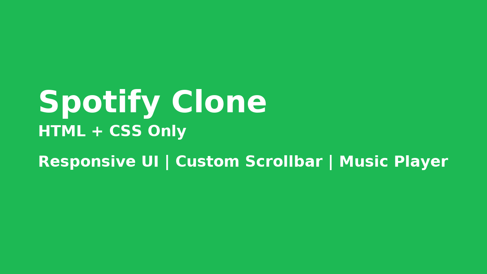

# 🎧 Spotify Clone

A clean, modern replica of the Spotify Web Player built **entirely using HTML and CSS**.

## 🚀 Project Highlights

- 🎨 Pixel-perfect layout inspired by [Spotify Web Player](https://open.spotify.com)
- 🧠 Responsive structure with Flexbox and CSS Grid
- 💾 No frameworks or JS – just pure HTML + CSS mastery
- 🔁 Reusable components for scalability
- 🧩 Custom scrollbars, sticky navigation, hover effects & media player UI

## 📸 Preview



## 🛠️ Technologies Used

- HTML5
- CSS3 (custom properties, flexbox, media queries)
- Google Fonts + Font Awesome

## 🤝 For Recruiters

> This project demonstrates frontend layout skills, attention to detail, and responsive UI design with no dependencies.

Check the comments in the code for insights on how the layout was structured and decisions made!

## 📁 How to Use

Simply clone this repository and open `spotifyClone.html` in your browser.

```bash
git clone https://github.com/CodeByAlmas/pure-html-css-spotify-clone.git
cd spotify-clone
open spotifyClone.html
```

---

## 💡 Future Improvements

- 🎶 Add JavaScript for functional media playback
- 📱 Improve mobile responsiveness (currently optimized for desktop)
- 🌐 Add accessibility features

---

## 📌 Author

**Mohd Almas**  
Front-End Developer passionate about building clean UIs & great user experiences.

---
